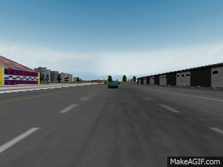
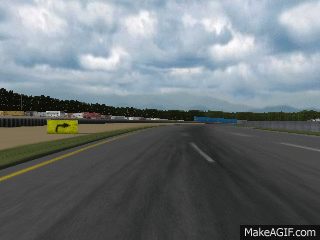

# [InfoGAIL: Interpretable Imitation Learning from Visual Demonstrations](https://arxiv.org/abs/1703.08840)

By Yunzhu Li, Jiaming Song, Stefano Ermon

### Introduction

Modified codebase of TORCS, with the ability to extract dashboard views.

InfoGAIL implementation, attached with two examples: *pass* & *turn*.

### Citing InfoGAIL

If you find this codebase useful in your research, please consider citing:

	@article{li2017inferring,
  	    title={InfoGAIL: Interpretable Imitation Learning from Visual Demonstrations},
  	    author={Li, Yunzhu and Song, Jiaming and Ermon, Stefano},
  	    journal={arXiv preprint arXiv:1703.08840},
  	    year={2017}
	}

### Requirements

1. Python 2.7
2. Tensorflow 0.12.1
3. Keras 1.2.2
4. xautomation

### Install and Configure TORCS

In the following section, we only show the commands for running example 0 (indicating *pass*). Users can replace 0 with 1 to run example 1 (indicating *turn*).

1. Install all the dependencies of TORCS, including but not limited to:

```
sudo apt-get install libplib-dev
sudo apt-get install libopenal-dev
sudo apt-get install libalut-dev
```

See http://torcs.sourceforge.net/ for more information

2. cd to the `torcs-1.3.4/` folder, type the following commands to install TORCS:

```
./configure
make
sudo make install
sudo make datainstall
```

Default installation directories are:

```
/usr/local/bin
/usr/local/lib/torcs
/usr/local/share/games/torcs
```

Run the `torcs` command to play TORCS.

3. Copy the modified tracks files in the `modified_tracks/` folder to the torcs folder `/usr/local/share/games/torcs/tracks/road`
4. Type the following commands to configure the running environment:

```
rm -rf ~/.torcs
cp -r torcs_config_ai_0 ~/.torcs
```

### Download training data and pretrained weights

1. Training data
- example 0 *(pass)* [GoogleDrive](https://drive.google.com/open?id=0B1mByo_qyT3PVi0ybFYyTDBKZTQ)
- example 1 *(turn)* [GoogleDrive](https://drive.google.com/open?id=0B1mByo_qyT3PU0JsRm9fOHR1SjA)

2. Pretrained weights
- example 0 [GoogleDrive](https://drive.google.com/open?id=0B1mByo_qyT3PcURxaF9JZExMN00)
- example 1 [GoogleDrive](https://drive.google.com/open?id=0B1mByo_qyT3PQ094cWZUdnFUaFk)

### Run with pretrained weights 

1. cd to `wgail_info_0/`

2. open `drive.py` and edit line 20-21 in concert with downloaded data and weights

3. change variable `code` in line 14 into different values (`0` or `1`) to observe different behaviors

4. type the `python drive.py` to run *pass* with pretrained weights

   Run *pass* with different latent codes (`0` or `1`):

    

   Run *turn* with different latent codes (`0` or `1`):

    

### Training

1. cd to `wgail_info_0/`
2. open `wgail_info.py` and edit line 17-19 in concert with downloaded data and weights
3. open `models.py` and edit line 508 to specify the place to store the weights, edit line 422 to specify the place to store the log file
4. type `python wgail_info.py` to train on *pass*, note that the weights trained via behavior cloning are used to initialize the policy network

### Misc.

1. Track selection:
   * *pass*: chenyi-Street 1
   * *turn*: chenyi-Brondehach

2. torcs-1.3.4 in this repository is a modified version of the original codebase released by Bernhard Wymann. This version holds the ability of extracting and transmitting visual information.

### References

[DeepDriving](http://deepdriving.cs.princeton.edu/)

[Using Keras and Deep Deterministic Policy Gradient to play TORCS](https://yanpanlau.github.io/2016/10/11/Torcs-Keras.html)

[TORCS - The Open Race Car Simulator](http://xed.ch/h/torcs.html)

[SnakeOil](http://xed.ch/project/snakeoil/index.html)

[Simulated Car Racing Championship Competition Software Manual](https://pdfs.semanticscholar.org/9b1d/e5d93854d9dc364a4bc6a462193ccc3ea895.pdf)
